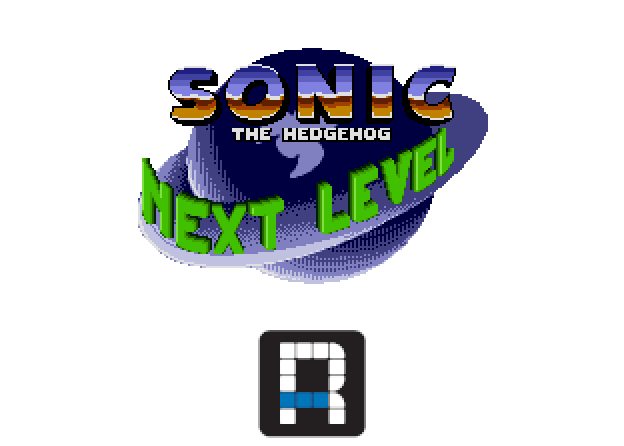

# **Sonic: The Next Level RSDK**

	
# FAQ
### Q: I found a bug!
A: Submit them under the `issues` tab and I will try to fix it.

### Q: I have a feature request. Will you add it? 
A: Most likely not, this will be a straight port of the Mega Drive/Genisis

### Q: When will this be finished?
A: It's done whenever it is done. Nobody runs on a deadline, it's all done based on motivation & time.

### Q: Will there be an Android, iOS, Steam Deck, etc port?
A: Everything in this project comes as-is. If it doesn't run on a specific platform, don't get your hopes up on it being fixed.

# Credits
* MarkeyJester (for the original romhack)
* Twanvanb1 (for the RSDKv4 Port)

# Special Thanks
* [Rubberduckycooly](https://github.com/Rubberduckycooly) for making the RSDKv4 decompilation.
* Everyone in the [Retro Engine Modding Server](https://dc.railgun.works/retroengine) for being supportive of us and for giving us a place to show off these things that we've done.

# Contact:
Join the [Retro Engine Modding Discord Server](https://dc.railgun.works/retroengine) for any extra questions about this project.
